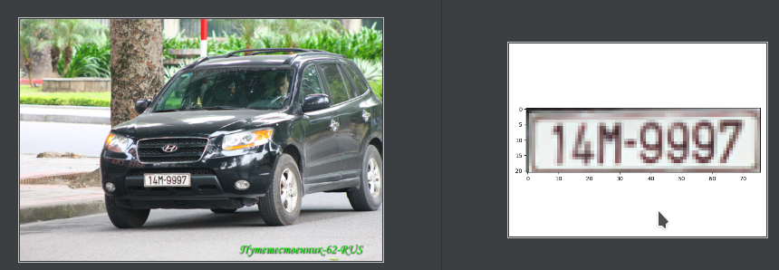
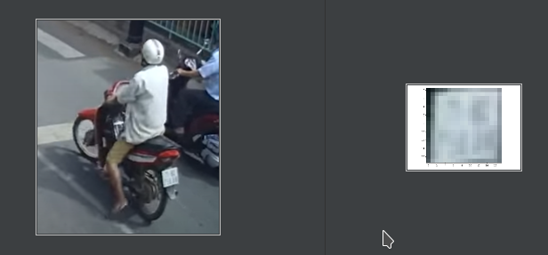

## Object-Corner-Detection: Crop an object from four corners
~ By Hisiter-HUST ~ 




Note:
- This repository can apply to:
  + License Plate Detection 
  + ID Detection 
  + ...

Keywords: Vietnamese License Plate Detection, ID Vietnamese Detection
## 1. Set up environment and dependent package 
- At root project, run:  
```bash
sh setup.sh

conda activate py36_torch1.4
```

## 2. Dataset format 
- Prepare custom dataset: [DATA.md](https://github.com/hisiter97/Object-Corner-Detection/blob/master/data/DATA.md)
- Format data: COCO
- Structure
```text

${Object-Corner-Detection_ROOT}
|-- center
|-- data
`-- |-- plate
    `-- |-- annotations
            |-- train_plate.json
            |-- val_plate.json

        |---images
            |--img_1.jpg
            |--img_2.jpg
```
## 3. Training:
- Edit config file at the center/config directory 
```bash
cd center 
python train.py --config config/plate.yml 
```

## 4. Testing:
```bash
cd center
python detect.py --config config/plate.yml --image_path ../img_test/plate.jpg 
```

## 5. DEMO 



